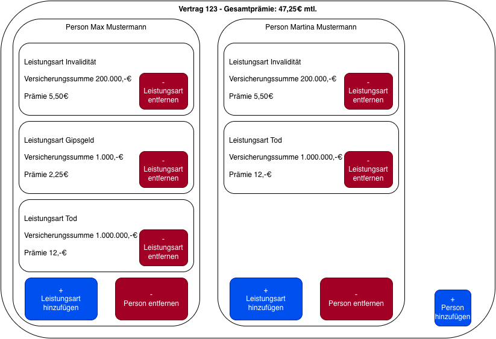

# TARIFBERECHNUNG EINER UNFALLVERSICHERUNG
## Aufgabenstellung für eine Live Coding Session

### Auftrag
Unser Kunde, die **Pfefferminzia Versicherungs AG**, beauftragt uns mit der Implementierung eines Services zur Tarifierung einer Unfallversicherung. Ziel ist die Ermittlung der Prämie, also den Beitrag, den der Versicherungsnehmer zu zahlen hat.

### Eine Unfallversicherung - fachlicher Kontext
Eine Unfallversicherung ist eine Form der Versicherung, die Schadensersatz für Personen- und Sachschäden durch Unfälle oder andere Ereignisse bereitstellt. Die Versicherung übernimmt die finanzielle Verantwortung für Schäden, die durch Unfälle entstehen, um den Versicherungsnehmer von finanziellen Schwierigkeiten zu befreien. Die Prämie, die der Versicherungsnehmer zahlen muss, hängt von verschiedenen Faktoren ab. In einem Unfallvertrag ist eine Menge von Personen versicherbar. Jede versicherte Person ist gegen eine individuell zu erfassende Menge von Risiken geschützt. Diese sogenannten Leistungsarten wirken sich primär auf die jeweilige Prämie für die versicherte Person aus. Die Prämie für den Vertrag ergibt sich aus der Summe der Prämien aller versicherten Personen.

### Domänenmodell - Auszug
Das fachliche Modell ergibt sich dann folgendermaßen:

### Leistungsarten
Jede Person kostet grundsätzlich 5,-€ Prämie. Die Pfefferminzia versichert folgende Risiken:
* **Invalidität**
  * Versicherungssumme 200.000,-€
  * Prämie 5,50€ mtl.
* **Tod**
  * Versicherungssumme 1.000.000,-€
  * Prämie 12,-€ mtl.
* **Gipsgeld**
  * Versicherungssumme 1.000,-€
  * Prämie 2,25€ mtl.

### Lösungsansatz
* Wir legen das Projekt unter Berücksichtigung technischer Vorgaben auf grüner Wiese an.
* Wir legen das Datenmodell an.
* Wir schreiben einen Service, welcher die Tarifierung eines Unfallvertrages implementiert.
* Wir entwerfen eine Nutzeroberfläche zur Eingabe und Anzeige der Daten.

### Technische Vorgaben
* Java 25
* REST Service
* Spring Boot 2.4.1
* Maven
* JUnit 5
* JPA
* H2
* Lombok
* Swagger
* Angular 20
* Angular Material

### Mock up
Die Oberfläche kann sich am folgenden Mockup orientieren:
